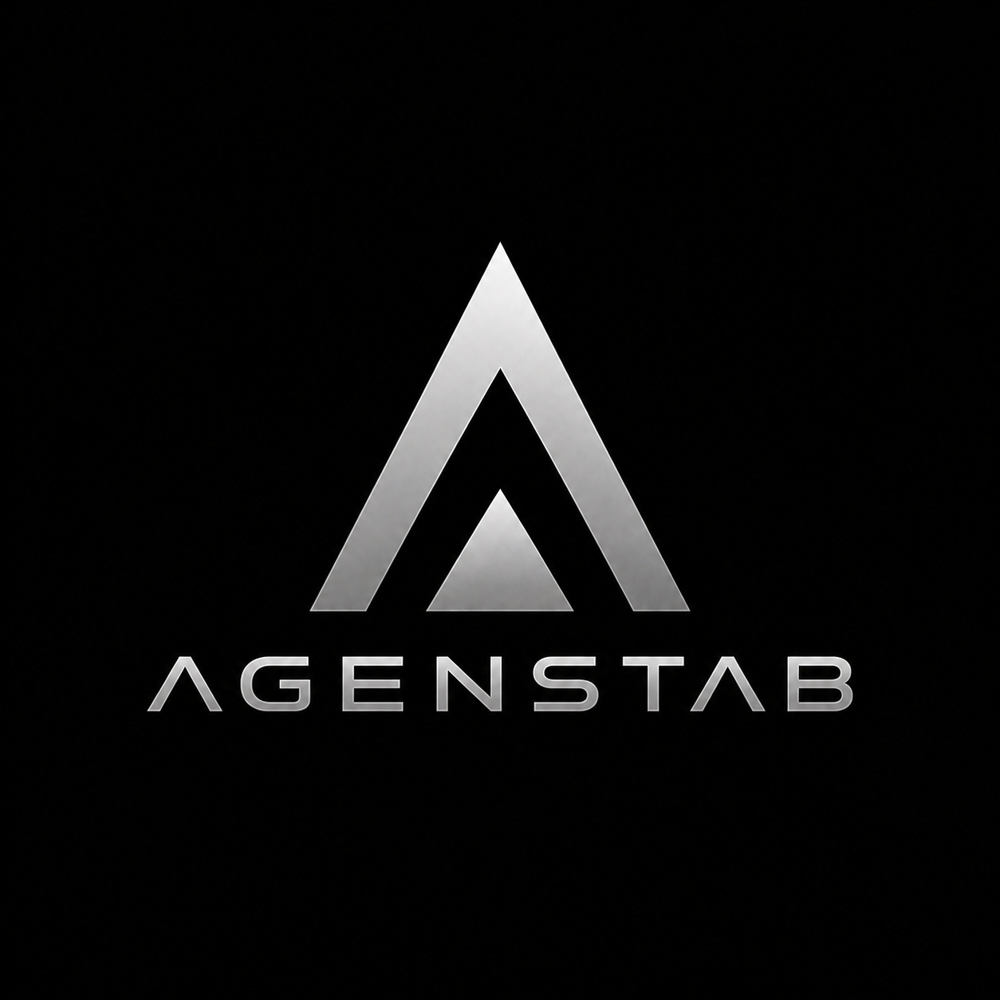

<div align="center">
  
  <br /><br />

  <h1>AGENSTAB</h1>

  <p><strong>The sovereign browsing engine for autonomous agents.</strong></p>
  <p>Give your AI agent eyes and hands on the web. <br />AXTree-first. WebSocket-native. Enterprise-grade.</p>

  <br />

  <p>
    <a href="https://agenstab.com"></a>
    <a href="https://agenstab.com/docs.html"></a>
    <a href="https://discord.gg/agenstab"></a>
  </p>
  <p>
    <a href="https://pypi.org/project/agens-tab/"></a>
    <a href="https://www.npmjs.com/package/@agenstab/sdk"></a>
    <a href="https://github.com/agenstab/agenstab-go"></a>
    <a href="https://github.com/agenstab/agenstab-official/blob/main/LICENSE"></a>
  </p>

  <br />

  <p>
    <a href="#-quickstart">Quickstart</a> ·
    <a href="#-how-it-works">How It Works</a> ·
    <a href="#-why-axtree">Why AXTree?</a> ·
    <a href="#-integrations">Integrations</a> ·
    <a href="#-api-reference">API</a> ·
    <a href="#-examples">Examples</a>
  </p>
</div>

<br />

---

<br />

## 🎬 Demo

https://github.com/user-attachments/assets/demo-placeholder

> An AI agent navigating SAP Fiori, filling a procurement form, and submitting an order — using only AXTree semantic primitives. No CSS selectors. No screenshots. [Watch on YouTube →](https://youtube.com/@agenstab)

<br />

---

<br />

## ⚡ Quickstart

### Python — 4 lines to your first agent

```bash
pip install agens-tab
```

```python
import asyncio
from agens_tab import BrowserAgent

async def main():
    # Connect to AGENSTAB
    agent = await BrowserAgent.init(api_key="ak_live_...")

    # Navigate
    await agent.navigate("https://example.com")

    # See what the agent sees — a structured accessibility tree
    state = await agent.observe()
    for element in state["axtree"]:
        print(f'  [{element["agent_id"]}] {element["role"]}: {element["name"]}')

    # Act on any element by its semantic ID
    await agent.click("a_42")
    await agent.type("a_15", "Hello from my agent")

    await agent.destroy()

asyncio.run(main())
```

<details>
<summary><strong>Node.js</strong></summary>

```bash
npm install @agenstab/sdk
```

```javascript
const { BrowserAgent } = require('@agenstab/sdk');

const agent = await BrowserAgent.init({ apiKey: 'ak_live_...' });
await agent.navigate('https://example.com');

const state = await agent.observe();
state.axtree.forEach(el => console.log(`[${el.agent_id}] ${el.role}: ${el.name}`));

await agent.click('a_42');
await agent.type('a_15', 'Hello from my agent');
await agent.destroy();
```

</details>

<details>
<summary><strong>Go</strong></summary>

```bash
go get github.com/agenstab/agenstab-go
```

```go
client, _ := agenstab.NewClient(ctx, agenstab.Config{APIKey: "ak_live_..."})
defer client.Destroy()

client.Navigate("https://example.com")
state, _ := client.Observe(nil)

for _, el := range state.AXTree {
    fmt.Printf("[%s] %s: %s\n", el.AgentID, el.Role, el.Name)
}

client.Click(state.AXTree[0].AgentID)
```

</details>

<br />

---

<br />

## 🧠 How It Works

```
Your Agent                    AGENSTAB Engine                    Browser
─────────                    ────────────────                    ───────
     │                              │                               │
     │──── WebSocket (JSON-RPC) ────►│                               │
     │     { method: "navigate",    │──── Playwright ───────────────►│
     │       params: { url } }      │                               │
     │                              │◄── Page loaded ───────────────│
     │                              │                               │
     │──── { method: "observe" } ───►│                               │
     │                              │──── Extract AXTree ──────────►│
     │◄─── { axtree: [...] } ──────│◄── Accessibility tree ────────│
     │                              │                               │
     │     Your LLM decides:        │                               │
     │     "Click Submit Order"      │                               │
     │                              │                               │
     │──── { method: "click",  ────►│                               │
     │       params: {a_42} }       │──── Click element ───────────►│
     │◄─── { success: true } ──────│◄── Done ──────────────────────│
     │                              │                               │
```

**The observe → think → act loop:**

1. **`observe()`** — AGENSTAB extracts the page's accessibility tree into a compact JSON array
2. **Your LLM reasons** — It reads the AXTree, decides what to do next
3. **`click()` / `type()` / `select()`** — Your agent executes the action using semantic `agent_id`s
4. **Repeat** — Until the task is complete

<br />

---

<br />

## 🌳 Why AXTree?

Every web page has a hidden structure that screen readers use — the **Accessibility Tree**. It contains every interactive element with its semantic role, name, and state. AGENSTAB extracts this tree instead of parsing raw HTML.

<table>
<tr>
<td width="50%">

**❌ What your agent sees with raw HTML**

```html
<div class="css-1dbjc4n r-1awozwy r-18u37iz
  r-1w6e6rj r-6gpygo r-13qz1uu"
  data-testid="submit-button-wrapper">
  <div role="button" tabindex="0"
    class="css-18t94o4 css-1dbjc4n
    r-1niwhzg r-p1pxzi r-6gpygo">
    <div dir="auto" class="css-901oao
      r-1awozwy r-jwli3a r-6koalj">
      Submit Order
    </div>
  </div>
</div>
```

~850 tokens. Breaks when classes change.

</td>
<td width="50%">

**✅ What your agent sees with AXTree**

```json
{
  "agent_id": "a_42",
  "role": "button",
  "name": "Submit Order",
  "bounds": [340, 520, 180, 48],
  "interactable": true
}
```

~30 tokens. Survives UI redesigns.

</td>
</tr>
</table>

### The numbers

| Metric | Raw HTML | CSS Selectors | Screenshot+Vision | **AGENSTAB AXTree** |
|---|:---:|:---:|:---:|:---:|
| Tokens per action | ~14,500 | ~8,000 | ~12,000 | **~450** |
| Breaks on UI change? | ✅ Yes | ✅ Yes | Sometimes | **❌ No** |
| Works on SPAs? | Partial | Partial | Yes | **Yes** |
| Works behind auth? | No | No | With extension | **Yes** |

<br />

---

<br />

## 🔌 Integrations

AGENSTAB works with any agent framework. Here's how:

<details>
<summary><strong>🦜 LangChain / LangGraph</strong></summary>

```python
from langchain.tools import tool
from agens_tab import BrowserAgent

@tool
def browse_web(url: str, task: str) -> str:
    """Navigate to a URL and extract information using AGENSTAB."""
    agent = await BrowserAgent.init(api_key="ak_live_...")
    await agent.navigate(url)
    state = await agent.observe()
    await agent.destroy()
    return str(state["axtree"])
```

</details>

<details>
<summary><strong>🤖 CrewAI</strong></summary>

```python
from crewai import Agent, Task
from agens_tab import BrowserAgent

class WebBrowserTool:
    def run(self, url: str) -> str:
        agent = await BrowserAgent.init(api_key="ak_live_...")
        await agent.navigate(url)
        state = await agent.observe()
        await agent.destroy()
        return str(state["axtree"])

researcher = Agent(
    role="Web Researcher",
    tools=[WebBrowserTool()],
    goal="Extract data from enterprise portals"
)
```

</details>

<details>
<summary><strong>🏗️ Custom Agent Loop</strong></summary>

```python
from agens_tab import BrowserAgent
from openai import OpenAI

client = OpenAI()
agent = await BrowserAgent.init(api_key="ak_live_...")
await agent.navigate("https://portal.example.com")

for step in range(10):
    state = await agent.observe()

    response = client.chat.completions.create(
        model="gpt-4o",
        messages=[{
            "role": "user",
            "content": f"Page elements:\n{state['axtree']}\n\nTask: Fill the purchase order form."
        }]
    )

    action = parse_action(response.choices[0].message.content)

    if action["type"] == "click":
        await agent.click(action["agent_id"])
    elif action["type"] == "type":
        await agent.type(action["agent_id"], action["text"])
    elif action["type"] == "done":
        break

await agent.destroy()
```

</details>

<br />

---

<br />

## 📡 API Reference

AGENSTAB uses **JSON-RPC 2.0** over WebSocket.

```
wss://api.agenstab.com/v1/session
Authorization: Bearer ak_live_...
```

<details>
<summary><strong>View all 18 methods</strong></summary>

| Method | Params | Description |
|---|---|---|
| `createSession` | `config?` | Start a new browser session |
| `navigate` | `url, waitUntil?` | Load a URL |
| `observe` | `prompt?, maxElements?` | Extract AXTree |
| `click` | `agentId` | Click an element |
| `type` | `agentId, text, clearFirst?` | Type into input |
| `select` | `agentId, optionValue` | Choose dropdown option |
| `scroll` | `direction, amount?, agentId?` | Scroll page/container |
| `fillForm` | `fields` | Fill multiple inputs |
| `screenshot` | `format?, quality?` | Capture viewport |
| `evaluate` | `script, timeout?` | Execute JavaScript |
| `waitFor` | `selector, timeout?` | Wait for element |
| `get_dom` | `format?` | Get clean/raw HTML |
| `clear_interstitials` | — | Dismiss cookie banners |
| `save_state` | — | Export cookies + localStorage |
| `restore_checkpoint` | `stateBlob` | Restore saved state |
| `get_audit_log` | — | Get action history |
| `pause` / `resume` | `reason?` | Human-in-the-loop |
| `destroy` | — | Terminate session |

</details>

Full protocol docs: [docs/rpc-protocol.md](docs/rpc-protocol.md)

<br />

---

<br />

## 📂 Examples

| Example | Language | Description |
|---|---|---|
| [scrape_catalog.py](examples/python/scrape_catalog.py) | Python | Extract product data from e-commerce catalog |
| [fill_form.js](examples/node/fill_form.js) | Node.js | Complete a multi-step application form |
| [monitor_prices.py](examples/python/monitor_prices.py) | Python | Track price changes across vendor portals |
| [sap_procurement.py](examples/python/sap_procurement.py) | Python | Automate SAP Fiori purchase order creation |

<br />

---

<br />

## 🏗️ Architecture

```
┌─────────────────────────────────────────────────────────────────┐
│                        AGENSTAB Engine                          │
│                                                                 │
│  ┌──────────────┐  ┌──────────────┐  ┌───────────────────────┐ │
│  │   AXTree     │  │   Stealth    │  │   Blueprint Engine    │ │
│  │   Extractor  │  │   Engine     │  │   SAP · Salesforce    │ │
│  │              │  │   Mouse      │  │   Workday · ServiceNow│ │
│  │   Semantic   │  │   Curves     │  │                       │ │
│  │   Pruning    │  │   Typing     │  │   Pre-mapped nav      │ │
│  │   Intent Map │  │   Cadence    │  │   patterns for        │ │
│  │              │  │   Viewport   │  │   enterprise apps     │ │
│  └──────┬───────┘  └──────┬───────┘  └───────────┬───────────┘ │
│         │                 │                      │              │
│  ┌──────┴─────────────────┴──────────────────────┴───────────┐ │
│  │                    Playwright Runtime                       │ │
│  │              Chromium Sandbox (V8 Isolate)                 │ │
│  └────────────────────────────────────────────────────────────┘ │
│                                                                 │
│  ┌────────────┐  ┌────────────┐  ┌────────────┐  ┌───────────┐│
│  │ Relational │  │ Distributed│  │ Envelope   │  │ Redaction ││
│  │ Database   │  │ Cache/Lock │  │ Encryption │  │   Proxy   ││
│  │   State    │  │   Layer    │  │ AES-256    │  │ PII Mask  ││
│  └────────────┘  └────────────┘  └────────────┘  └───────────┘│
└─────────────────────────────────────────────────────────────────┘
        ▲                                           │
        │              JSON-RPC / WebSocket          │
        │                                           ▼
┌───────────────┐                          ┌────────────────┐
│   Your Agent  │                          │ Chrome Extension│
│   Python/Node │                          │  (No code      │
│   /Go/Custom  │                          │   required)    │
└───────────────┘                          └────────────────┘
```

| Component | Purpose |
|---|---|
| **AXTree Extractor** | Parses Chromium accessibility tree into compact JSON |
| **Stealth Engine** | Behavioral humanization (mouse curves, typing cadence) |
| **Blueprint Engine** | Pre-mapped patterns for enterprise apps |
| **VLM Grounding** | Vision fallback via GPT-4o, Claude, or self-hosted vLLM |
| **Redaction Proxy** | Automatic PII masking before data leaves sandbox |
| **Observation Engine** | DOM mutation monitoring with smart re-extraction |

<br />

---

<br />

## 💰 Pricing

| | Free | Developer | Builder | Team | Enterprise |
|---|:---:|:---:|:---:|:---:|:---:|
| **Price** | $0/mo | $19/mo | $79/mo | $499/mo | Custom |
| **Session-minutes** | 2,000 | 15,000 | 75,000 | 500,000 | Unlimited |
| **Concurrent tabs** | 1 | 5 | 10 | 20 | Unlimited |
| **AXTree** | ✅ | ✅ | ✅ | ✅ | ✅ |
| **Semantic mode** | — | ✅ | ✅ | ✅ | ✅ |
| **VLM Vision** | — | — | ✅ | ✅ | ✅ |
| **Self-hosted** | — | — | — | — | ✅ |

[Get your API key →](https://agenstab.com/auth.html)

<br />

---

<br />

## 🔒 Security

- **Zero-retention** — Session data is not persisted after termination
- **AES-256-GCM** — All audit logs encrypted via AWS KMS
- **robots.txt** — RFC 9309 compliant enforcement
- **PII redaction** — Automatic masking before data leaves sandbox
- **SOC 2** — Audit in progress, available Q3 2026
- **HIPAA/GDPR-ready** — BAA available for Enterprise

[Security policy →](SECURITY.md) · [Report a vulnerability →](mailto:security@agenstab.com)

<br />

---

<br />

## 🤝 Contributing

We welcome contributions — examples, bug reports, SDK improvements, and documentation.

See [CONTRIBUTING.md](CONTRIBUTING.md) for guidelines.

<br />

---

<br />

## 📄 License

Source-available under [proprietary license](LICENSE). Free tier available at [agenstab.com](https://agenstab.com).

<br />

---

<div align="center">
  <br />
  <strong>Built for machines. Operated by agents. Governed by you.</strong>
  <br /><br />
  <a href="https://agenstab.com">Website</a> ·
  <a href="https://agenstab.com/docs.html">Documentation</a> ·
  <a href="https://discord.gg/agenstab">Discord</a> ·
  <a href="https://twitter.com/agenstab">Twitter</a> ·
  <a href="https://youtube.com/@agenstab">YouTube</a>
  <br /><br />
  <sub>If AGENSTAB helps your work, consider giving us a ⭐</sub>
</div>
